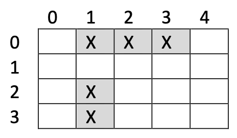

<!--- Technische Informatik (FK04)"
Author: Benjamin Kormann			Date: <2022 Feb 03> 
Changes by:
<NAME> - <JJJJ MMM DD> - <comment> 

--->
  

**TI3-Programmieren: Versuch 02**

Sommersemester 2023 | V 1.0 | Prof. Dr. Fabian Flohr
Original assignments provided by Prof. Dr. Benjamin Korman

***
# Zielsetzung: Schiffe versenken

In diesem Versuch werden die bisherigen Python Kenntnisse anhands des Spiels *Schiffe versenken* vertieft.


## Allgemeine Hinweise

Bevor Sie mit der Bearbeitung dieses Versuchs starten lesen Sie bitte die allgemeinen Hinweise auf der ersten Seite genau durch.

### Verwendung von CI/CD

Für die Bearbeitung des Praktikumsversuchs wird Ihnen neben der Versionsverwaltung Git die sog. Continuous Integration (CI) Funktionalität von GitLab zur Verfügung gestellt. Diese bewirkt, dass Sie ihren entwickelten Softwarestand in Ihr eigenes Repository in GitLab pushen können und anschließend werden automatisiert Tests auf Ihren Quelltext ausgeführt. Darüber haben Sie die Möglichkeit, selbst festzustellen, ob Ihre Implementierung noch grundlegende Fehler enthält. Wichtig dabei zu wissen ist, dass erfolgreiche Tests noch keine Garantie dafür sind, dass Ihr Programm am Ende keine Fehler enthält. Aber es werden grundsätzliche Aspekte geprüft. Hierzu wird empfohlen, dass Sie in dem PDF-Dokument *Einführung in das Versionsverwaltungssystem Git und das LRZ GitLab* die Abschnitte 3.4.2 vollständig lesen.

### Abgabe des Versuchs

Jeder Praktikumsteilnehmer muss den eigenen Versuch beim jeweiligen Praktikumsbetreuer vorstellen und Fragen zu der Lösung beantworten. Dabei ist es auch wichtig, dass *Ihre eigene Lösung in Ihrem eigenen Git Repository in GitLab* (`git push`) vorhanden ist.

### Abnahmekriterien

Bei der Abgabe werden die Praktikumsbetreuer nicht nur auf die Funktionalität, sprich das zu erreichende Ergebnis achten. Die erfolgreiche Abgabe unterliegt den folgenden Kriterien:
1. **Aufgabenstellung** ist funktional **erfüllt**
2. Die **Testfälle** laufen alle **erfolgreich** durch
3. **Fragen** zur Lösung und zu Konzepten in Python **müssen beantwortet werden**
4. Sie haben ausreichend (mehr als 4) **commit Nachrichten** im akutellen Versuchsordner in Git erstellt
5. Der Quelltext besitzt einen **Dokumentationsgrad** von **mindestens 25 %** (Der Dokumentationsgrad bestimmt sich aus der Anzahl der Kommentarzeilen im Quelltext (Zeilen mit #) im Verhältnis zu der Gesamtanzahl Zeilen Quelltext.)

Die Punkte 4) und 5) werden automatisiert ermittelt. Bei dem Gespräch mit dem Praktikumsbetreuer stellen Sie neben Ihrer eigenen Lösung auch die Punkte 4) und 5) eigenständig mit vor.

Mit Hilfe der CI/CD Lösung von GitLab werden mit jedem `git push` automatisch die Testfälle ausgeführt und der Dokumentationsgrad aller .py-Dateien ermittelt. Zum Abrufen der Ergebnisse der ausgeführten Testfälle gehen Sie wie vor im **Abschnitt 3.4.2.2** im Einführungsdokument zu Git beschrieben. Für die Bewertung des Dokumentationsgrads wird das Tool `radon` (Sie müssen dieses Tool nicht installieren. Es ist in GitLab hinterlegt. Quelle: https://pypi.org/project/radon) verwendet, welches das Ergebnis als Artefakt der CI/CD-Pipeline zur Verfügung stellt. Lesen Sie dazu auch den **Abschnitt 3.4.2.3** im Einführungsdokument zu Git.

### WICHTIG

Sie dürfen in diesem Versuch alle Ihnen bislang vermittelten Python-Konstrukte verwenden. Gehen Sie schrittweise vor und überspringen Sie die Aufgaben nicht. Gehen Sie erst zur nächsten Aufgabe weiter, wenn die Funktionalität der zu bearbeitenden Aufgabe erfolgreich abgeschlossen ist.

Die zur Verfügung gestellten Unit Tests helfen Ihnen dabei festzustellen, ob Ihre Lösung richtig ist. Dazu ist es erforderlich, dass Sie sich genau an die vorgegebenen Funktionsnamen halten.

**Ihnen wird vermutlich auffallen, dass die Pipeline für den ersten Praktikumsversuch nicht mehr gestartet wird. Die Pipeline wurde so konfiguriert, dass sie für den ersten Praktikumsversuch nur noch gestartet wird, wenn es Änderungen an .py Dateien des ersten Versuchs gibt. Die Pipeline für diesen Versuch wieder immer ausgeführt.**


# Aufgabenstellung

Ein Raster mit `n` Zeilen und `m` Spalten (dem Gebiet) wird mit Schiffen belegt. Die Schiffe bestehen dabei aus horizontal oder vertikal nebeneinanderliegenden Feldern. Die Anzahl der Felder wird auch Länge des Schiffs genannt.

 


Die Zeilen und Spalten werden beginnend bei `0` indiziert. Es ist üblich, die Zeile zuerst zu nennen. Das vertikale Schiff im oberen Beispiel belegt die Felder `(2,1)` und `(3,1)`.


## Aufgabe 1: Das Spielfeld

Überlegen Sie sich eine Datenstruktur für die Repräsentation des Gebiets und seine Schiffsbelegung in obigem Beispiel. Definieren Sie eine Funktion `create_area(size)`, die ein leeres Gebiet (Einträge müssen als `‘ ‘` codiert werden) zurückliefert. Der Parameter `size` ist dabei ein Tupel, das die Höhe und Breite des Gebiets angibt. Der erste Wert im Tuple entspricht der Höhe, der zweite der Breite des Spielfeldes.

Für eine spätere einheitliche Ausgabe ist davon ausgehen, dass weder die Höhe noch die Breite den Wert `10` überschreitet und den Wert `2` unterschreitet. Sollte dies der Fall sein, so ist `None` zurückzugeben, andernfalls wird ein Objekt in Form der Datenstruktur eines Spielfelds zurückgegeben.

Testen Sie die Funktion.

> Nach Abschluss fügen Sie alle Änderungen dem Git Repository hinzu und versehen die Änderungen mit einer **aussagekräftigen** commit Nachricht.

> Sie können nun die CI/CD Funktionalität zum automatisierten Test Ihrer Aufgabe 1 verwenden. Pushen Sie den aktuellen Stand in GitLab und betrachten Sie die Ergebnisse der Unit Tests in GitLab. Diese sollten grün (erfolgreich) sein.


## Aufgabe 2: Die Schiffspositionierung

Definieren Sie eine Funktion `fill_area(area, p0, is_horiz, length)`, die ein Schiff der Länge `length` in das Gebiet `area` ab Position `p0` einträgt. Tragen Sie als Position das Zeichen `‘X‘` ein. Das Tuple `p0` beinhaltet den Zeilen- und Spaltenindex der Position. Der erste Wert entspricht dem Zeilenindex. Der boolsche Übergabeparameter `is_horiz` zeigt an, ob das Schiff horizontal (nach rechts) oder vertikal (nach unten) eingetragen werden soll. 

*Hinweis*: Die Funktion überprüft nicht, ob das Positionieren überhaupt möglich ist. Diese Aufgabe übernimmt die Funktion in Aufgabe 4. Nutzen Sie für das Positionieren eines horizontalen Schiffes die `Slice-Zuweisung. (Also die Angabe eines Slice auf der linken Seite des Zuweisungsoperators.)

Testen Sie die Funktion.

> Nach Abschluss fügen Sie alle Änderungen dem Git Repository hinzu und versehen die Änderungen mit einer **aussagekräftigen** commit Nachricht.

> Sie können nun die CI/CD Funktionalität zum automatisierten Test Ihrer Aufgabe 2 verwenden. Pushen Sie den aktuellen Stand in GitLab und betrachten Sie die Ergebnisse der Unit Tests in GitLab. Diese sollten grün (erfolgreich) sein.

## Aufgabe 3: Die Spielfeldausgabe

Definieren Sie eine Funktion `print_area(area, title)`, die das Schiffsbelegungsschema durch ein `'X'` visualisiert. Für ein `4x5` Spielfeld mit zwei Schiffen in dem Feld, soll die Ausgabe wie folgt aussehen:
```
Spieler 1
 |01234|
0| XXX |
1|     |
2| X   |
3| X   |
 |01234| 
```

In der ersten Zeile wird der Titel (Argument des 2. Parameters) ausgegeben, im Beispiel der String `'Spieler 1'`. Für die Ausgabe der zweiten Zeile ist es sinnvoll eine Funktion `print_column_numbers(n)` zu erstellen, da die Ausgabe in der letzten Zeile wiederholt wird.

*Hinweise:*

- Die Zeile `width, height = len(area[0]), len(area)` zu Beginn der Funktion ist sinnvoll.
- Ein Zeichen `'X'` können Sie ohne anschließenden Zeilenumbruch durch `print('X', end='')` ausgeben
- Sollten Sie mehrere Schiffe entdecken, als Sie positioniert haben, dann liegt das in den meisten Fällen an einer fehlerhaften `create_area()`-Funktion. Meist speichern Sie die Referenz einer Zeile für alle Zeilen im Spielfeld ab, anstelle jeweils eines neuen Objektes (flache oder tiefe Objektkopie). Objektkopien können mithilfe einer geeigneten Konstruktion (Comprehensions), der Methode `copy()` oder eine `Slice`-Zuweisung auf objekt[:] ausgeführt werden. **Probieren Sie alle drei Möglichkeiten aus.**

> Nach Abschluss fügen Sie alle Änderungen dem Git Repository hinzu und versehen die Änderungen mit einer **aussagekräftigen** commit Nachricht.

> Pushen Sie den aktuellen Stand in GitLab. Für Aufgabe 3 stehen keine Unit Tests zur Verfügung.

## Aufgabe 4: Die Positionsprüfung

Definieren Sie eine Funktion `check_area(area, p0, is_horiz, length)`, die überprüft, ob ein Schiff der Länge `length` in das Gebiet `area` ab Position `p0` eingetragen werden kann, ohne sich mit einem schon bestehenden Schiff zu überlappen. Außerdem ist vorab zu prüfen, ob der Zeilen- bzw. Spaltenindex gültig sind (also weder die möglichen Werte unter- noch überschreiten) und das Schiff an der angegebenen Position überhaupt in das Spielfeld passt. Im Fall eines möglichen Eintrags soll die Funktion `True` zurückliefern, sonst `False`.

*Für Profis*: Die offiziellen Schiffe-Versenken-Regeln verlangen ein leeres Feld Abstand zwischen zwei Schiffen. Ergänzen Sie die Funktion um den optionalen Parameter:
```
check_area(area, p0, is_horiz, length, profi_check=False)
```
Sollte für dieses Argument `True` übergeben werden, so wird eine Schiffsbelegung nur als gültig bewertet wird, wenn auch die Umgebung frei ist.

> Nach Abschluss fügen Sie alle Änderungen dem Git Repository hinzu und versehen die Änderungen mit einer **aussagekräftigen** commit Nachricht.

> Sie können nun die CI/CD Funktionalität zum automatisierten Test Ihrer Aufgabe 4 verwenden. Pushen Sie den aktuellen Stand in GitLab und betrachten Sie die Ergebnisse der Unit Tests in GitLab. Diese sollten grün (erfolgreich) sein.

## Aufgabe 5: Die zufällige Schifspositionierung

Definieren Sie eine Funktion `generate_boat(area, boat_spec)`, die ein Schiff der Länge `boat_spec` im Gebiet area zufällig belegt. 

*Hinweis*: Eine gleichverteilte zufällige ganze Zahl im Intervall von `a` bis einschließlich `b` erhalten Sie mit Hilfe
```
import random                            # nur einmal zu Beginn der Datei

number = random.randint(a,b)
```

Sollte die zufällige Schiffspositionierung scheitern, so ist diese mit einer neuen zufälligen Position/Ausrichtung zu wiederholen. Nach einer – von Ihnen sinnvoll – festgelegten Anzahl von Versuchen ist die Funktion ergebnislos zu beenden. 

*Hinweis*: Nutzen Sie die bereits erstellten Funktionen.

> Nach Abschluss fügen Sie alle Änderungen dem Git Repository hinzu und versehen die Änderungen mit einer **aussagekräftigen** commit Nachricht.

> Sie können nun die CI/CD Funktionalität zum automatisierten Test Ihrer Aufgabe 5 verwenden. Pushen Sie den aktuellen Stand in GitLab und betrachten Sie die Ergebnisse der Unit Tests in GitLab. Diese sollten grün (erfolgreich) sein.


## Aufgabe 6: Die zufällige Mehrfach-Schiffspositionierung

Erweitern Sie die Funktion `generate_boat(area, boat_spec)` um die Möglichkeit, mehrere Schiffe anzulegen. Hierzu soll `boat_spec` neben einer ganzen Zahl auch ein Dictionary enthalten dürfen, das die Länge und Anzahl der gewünschten Schiffe als Schlüssel-Wert-Paar des Dictionaries angibt. So soll z. B. `generate_boat(area, {2:2, 3:1})` zwei Schiffe der Länge 2 und ein Schiff der Länge 3 generieren. 

Testen Sie die Funktion.

*Hinweis*: Nutzen Sie die Möglichkeit, `generate_boat()` mit einem Integer als `boat_spec` aufzurufen (**rekursiver Aufruf derselben Funktion**). Denken Sie an die Möglichkeit, über Dictionaries mit `for (key,val) in dictionary.items():` zu iterieren.


> Nach Abschluss fügen Sie alle Änderungen dem Git Repository hinzu und versehen die Änderungen mit einer **aussagekräftigen** commit Nachricht.

> Sie können nun die CI/CD Funktionalität zum automatisierten Test Ihrer Aufgabe 6 verwenden. Pushen Sie den aktuellen Stand in GitLab und betrachten Sie die Ergebnisse der Unit Tests in GitLab. Diese sollten grün (erfolgreich) sein.
