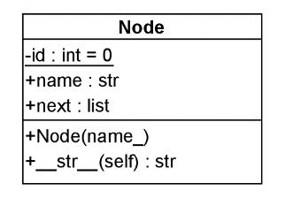
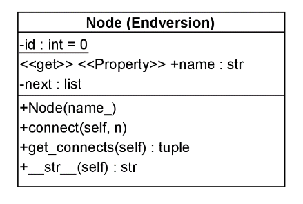
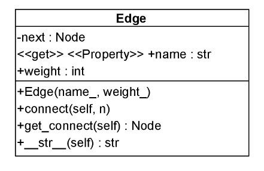
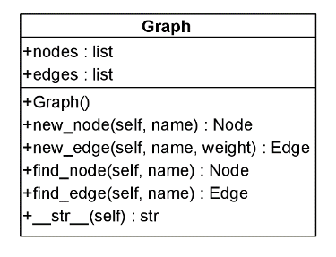

<!--- Technische Informatik (FK04)"
Author: Benjamin Kormann			Date: <2022 Feb 03> 
Changes by: Fabian Flohr            Date: <2023 Mar 16> 
--->
  

**TI3-Programmieren: Versuch 04**

Sommersemester 2023 | V 1.0 | Prof. Dr. Fabian Flohr; original assignments provided by Prof. Dr. Benjamin Korman

***
# Zielsetzung: Straßenkarten als Graphen

Eine Straßenkarte soll im Rechner repräsentiert werden, als grundlegende Datenstruktur soll ein Graph zum Einsatz kommen. Die Knoten des Graphen stehen dabei für Straßenkreuzungen (und Einmündungen), die Kanten für die Straßen zwischen den Kreuzungen. Der Einfachheit halber sind die Kanten gerichtet (können also als Einbahnstraßen interpretiert werden).

Sowohl die Knoten als auch die Kanten besitzen einen unveränderlichen Namen, die Kanten zusätzlich Gewichte (die der Weglänge entsprechen). Auch weitere Informationen (wie. z. B. die Art der Straße, Geschwindigkeitsbeschränkungen etc.) können sinnvoll sein.

Für die Arbeit mit Karten sind neben den genannten Daten auch eine Reihe von Operationen wichtig. Um die Übersicht zu behalten und den Nutzern eine einfache Programmierschnittstelle zu bieten, empfiehlt sich die Organisation in Klassen. 


## Allgemeine Hinweise

Bevor Sie mit der Bearbeitung dieses Versuchs starten lesen Sie bitte die allgemeinen Hinweise auf der ersten Seite genau durch.

### Verwendung von CI/CD

Für die Bearbeitung des Praktikumsversuchs wird Ihnen neben der Versionsverwaltung Git die sog. Continuous Integration (CI) Funktionalität von GitLab zur Verfügung gestellt. Diese bewirkt, dass Sie ihren entwickelten Softwarestand in Ihr eigenes Repository in GitLab pushen können und anschließend werden automatisiert Tests auf Ihren Quelltext ausgeführt. Darüber haben Sie die Möglichkeit, selbst festzustellen, ob Ihre Implementierung noch grundlegende Fehler enthält. Wichtig dabei zu wissen ist, dass erfolgreiche Tests noch keine Garantie dafür sind, dass Ihr Programm am Ende keine Fehler enthält. Aber es werden grundsätzliche Aspekte geprüft. Hierzu wird empfohlen, dass Sie in dem PDF-Dokument *Einführung in das Versionsverwaltungssystem Git und das LRZ GitLab* die Abschnitte 3.4.2 vollständig lesen.

### Abgabe des Versuchs

Jeder Praktikumsteilnehmer muss den eigenen Versuch beim jeweiligen Praktikumsbetreuer vorstellen und Fragen zu der Lösung beantworten. Dabei ist es auch wichtig, dass *Ihre eigene Lösung in Ihrem eigenen Git Repository in GitLab* (`git push`) vorhanden ist.

### Abnahmekriterien

Bei der Abgabe werden die Praktikumsbetreuer nicht nur auf die Funktionalität, sprich das zu erreichende Ergebnis achten. Die erfolgreiche Abgabe unterliegt den folgenden Kriterien:
1. **Aufgabenstellung** ist funktional **erfüllt**
2. Die **Testfälle** laufen alle **erfolgreich** durch
3. **Fragen** zur Lösung und zu Konzepten in Python **müssen beantwortet werden**
4. Sie haben ausreichend (mehr als 4) **commit Nachrichten** in Git erstellt
5. Der Quelltext besitzt einen **Dokumentationsgrad** von **mindestens 25 %** (Der Dokumentationsgrad bestimmt sich aus der Anzahl der Kommentarzeilen im Quelltext (Zeilen mit #) im Verhältnis zu der Gesamtanzahl Zeilen Quelltext.)

Die Punkte 4) und 5) werden automatisiert ermittelt. Bei dem Gespräch mit dem Praktikumsbetreuer stellen Sie neben Ihrer eigenen Lösung auch die Punkte 4) und 5) eigenständig mit vor.

### WICHTIG

Sie dürfen in diesem Versuch alle Ihnen bislang vermittelten Python-Konstrukte verwenden. Gehen Sie schrittweise vor und überspringen Sie die Aufgaben nicht. Gehen Sie erst zur nächsten Aufgabe weiter, wenn die Funktionalität der zu bearbeitenden Aufgabe erfolgreich abgeschlossen ist.

Die zur Verfügung gestellten Unit Tests helfen Ihnen dabei festzustellen, ob Ihre Lösung richtig ist. Dazu ist es erforderlich, dass Sie sich genau an die vorgegebenen Funktionsnamen halten.

**Ihnen wird vermutlich auffallen, dass die Pipeline für die vorherigen Versuche nicht mehr gestartet werden. Die Pipeline wurde so konfiguriert, dass sie für die bisherigen Praktikumsversuche nur noch gestartet wird, wenn es Änderungen an .py Dateien dieser Versuche gibt. Die Pipeline für diesen Versuch wieder immer ausgeführt.**


# Aufgabenstellung

## Aufgabe 1: Aufbau der Klasse Node

**1. Schritt**

Implementieren Sie die Klasse `Node`, deren Struktur in folgendem Klassendiagramm abgebildet ist. Das Attribut `next` ist dabei eine Liste der Nachfolgeknoten. Die private `id` beschreibt eine ganze Zahl (Sie können die **statische** Klassenvariable zunächst einfach auf 0 setzen). 
Konstruieren Sie in der Methode `__str__()` zuerst einen String, der die nötigen Informationen für den Knoten beinhaltet. Speichern Sie die Klasse im Modul `node1.py`. 


  

Testen Sie die Klasse nach der Klassendefinition (ohne dass der Test im Unittest mit aufgerufen wird!)

```
n1 = Node('A')
n2 = Node('B')
n3 = Node('C')
n1.next.append(n2)
n1.next.append(n3)
print(n3.name)
print(n1)
print(n2)
```

Folgende Ausgabe soll sich ergeben:
```
C
A ---> B
  ---> C
B <end>
```

**2. Schritt**

Kopieren Sie nun die Datei `node1.py` in die Datei `node2.py`. Modifizieren Sie die Klasse `Node` der letzten Teilaufgabe so, dass `name` eine nur lesbare Eigenschaft (des entsprechenden privaten Attributs) darstellt. Test innerhalb von `node2.py`:
```
n1 = Node('A')
print(n1.name)
n1.name = 'B'      # die Zeile soll zu einem Fehler führen!
```

**3. Schritt**

Kopieren Sie nun die Datei `node2.py` in die Datei `node3.py`. Modifizieren Sie die Klasse `Node` der letzten Teilaufgabe, so dass es möglich ist, den Konstruktor auch ohne Angabe eines Knotennamens aufzurufen. In diesem Fall soll der (eindeutige) Standardname "Knoten XXX" verwendet werden, wobei XXX für die laufende Nummer des Knotens steht. 

**4. Schritt**

Modifizieren Sie die Klasse `Node` des Moduls `node3.py` so, dass das Hinzufügen eines Nachfolgeknotens nur noch über die Methode `connect()` möglich ist. 

Testen Sie die Klasse nach der Klassendefinition (ohne dass der Test im Unittest mit aufgerufen wird!)

```
n1 = Node()
n2 = Node('B')
n3 = Node()
n1.connect(n2)
n1.connect(n3)
print(n1)
print(n2)
```

Folgende Ausgabe soll sich ergeben:
```
Knoten 1 ---> B
         ---> Knoten 3
B <end>
```
Beachten Sie, dass die Pfeildarstellungen abhängig vom Knotennamen in derselben Spalte beginnen!

**5. Schritt**

Ergänzen Sie die Klasse `Node` des Moduls `node3.py` um die Methode `get_connects()`, die die Listenelemente der Nachfolgeknoten als `tuple` zurückgibt. Das endgültige Klassendiagramm der Klasse `Node` ist damit:

 

> Nach Abschluss fügen Sie alle Änderungen dem Git Repository hinzu und versehen die Änderungen mit einer **aussagekräftigen** commit Nachricht.

> Sie können nun die CI/CD Funktionalität zum automatisierten Test Ihrer Aufgabe 1 verwenden. Pushen Sie den aktuellen Stand in GitLab und betrachten Sie die Ergebnisse der Unit Tests in GitLab. Diese sollten grün (erfolgreich) sein.


## Aufgabe 2: Die Klasse Edge

**1. Schritt**

Implementieren Sie die Klasse `Edge`, deren Struktur in folgendem Klassendiagramm abgebildet ist. Die Methode `connect()` setzt dabei den (maximal einen) Zielknoten der Kante (der Ausgangsknoten wird hier zunächst nicht betrachtet). Die Methode `get_connect()` gibt den Zielknoten zurück. Das Property `name` stellt wie in der Klasse `Node` eine nur lesbare Eigenschaft dar, Speichern Sie die Klasse im Modul `edge.py`.

 

Testen Sie die Klasse mit dem folgenden Quelltext:

```
import node3
n1 = node3.Node('A')
e1 = Edge('E', 5)
e1.connect(n1)
print('vorher:', e1)
e1.weight=3
print('nachher:', e1)
```

Folgende Ausgabe soll sich ergeben:
```
vorher: E/5
nachher: E/3
``` 

**2. Schritt**

Kopieren Sie nun den Inhalt der Datei `node3.py` in die Datei `node.py`. Modifizieren sie dann die Klasse `Node`, so dass die Methode `connect()` nun jeweils eine Kante mit dem Knoten verbindet (und dadurch eine andere Ausgabe liefert). 

```
n1 = node.Node('A')
n2 = node.Node('B')
n3 = node.Node('C')
e1 = edge.Edge('E', 5)
e2 = edge.Edge('F', 2)
n1.connect(e1)
n1.connect(e2)
e1.connect(n2)
e2.connect(n3)
print(n1)
print(n2)
```

Folgende Ausgabe soll sich ergeben:
```
A –-E/5--> B
  --F/2--> C
B <end>
```

> Nach Abschluss fügen Sie alle Änderungen dem Git Repository hinzu und versehen die Änderungen mit einer **aussagekräftigen** commit Nachricht.

> Sie können nun die CI/CD Funktionalität zum automatisierten Test Ihrer Aufgabe 2 verwenden. Pushen Sie den aktuellen Stand in GitLab und betrachten Sie die Ergebnisse der Unit Tests in GitLab. Diese sollten grün (erfolgreich) sein.


## Aufgabe 3: Die Klasse Graph

**1. Schritt**

Implementieren Sie eine Klasse `Graph`, die eine Liste von Knoten und eine Liste von Kanten enthält, in der Datei `graph.py`. 

Das folgende Testprogramm soll mit der Klasse `Graph` durchführbar sein:
```
g = Graph()
n1 = g.new_node('A')
n2 = g.new_node()
e1 = g.new_edge('E', 5)
n1.connect(e1)
e1.connect(n2)
print(g)
```

Folgende Ausgabe soll sich ergeben:
```
Knoten:
-------
A –-E/5--> Knoten 2
Knoten 2 <end>

Kanten:
-------
E/5
```

**2. Schritt**

Erweitern Sie die Klasse `Graph` um die Methoden `find_node(self, name)` und `find_edge(self, name)`, die den Knoten mit dem angegebenen Namen zurückgibt. Testen Sie die Methode z.B. mit `print(g.find_node('Knoten 2'))`.

*Tipp*: Eine mögliche Implementierung von `find_edge()` ist:
```
def find_edge(self, name):
	r = None
	for e in self.edges:
		if e.name == name:
			r = e
			break
	return r
```

Insgesamt sieht das Klassendiagramm der Klasse `Graph` dann wie folgt aus:

 

**3. Schritt**

Unter einem Pfad versteht man eine Folge im Graph benachbarter Knoten. Erweitern Sie die Klasse `Graph` um die Methode `path_length(self, path_node_names)`, die die Knotennamen des Pfades als Liste akzeptiert und die Gesamtlänge des Pfades ermittelt.

Existiert so ein Pfad nicht, soll -1 zurückgegeben werden. Testen Sie die Methode an einem selbst definierten Graphen.
*Tipp*: Es kann sinnvoll sein, eine statische Methode `find_edge_between(n1, n2)` einzuführen, die im Graphen eine Kante (Edge-Objekt) sucht, die die beiden `Node` Objekte `n1` und `n2` verbindet. Falls eine derartige Kante nicht existiert gibt sie `None` zurück.

> Nach Abschluss fügen Sie alle Änderungen dem Git Repository hinzu und versehen die Änderungen mit einer **aussagekräftigen** commit Nachricht.

> Sie können nun die CI/CD Funktionalität zum automatisierten Test Ihrer Aufgabe 3 verwenden. Pushen Sie den aktuellen Stand in GitLab und betrachten Sie die Ergebnisse der Unit Tests in GitLab. Diese sollten grün (erfolgreich) sein.

## Aufgabe 4: Die bereitgestellte Klasse Reader und XML

Die Ihnen zur Verfügung gestellte Klasse `Reader` im Modul `reader.py` implementiert eine Lesemethode für XML-Dateien, die einen Graphen in textueller Form darstellen. Reader besitzt dabei die Methode `read()`, die als Argument den Pfad zur XML-Datei erwartet und den Graphen als Exemplar der Klasse `Graph` zurückgibt. `Reader` importiert dazu die Klasse `Graph` und nutzt deren Methoden und Attribute.

**1. Schritt**

Betrachten Sie die beigefügten beispielhaften XML-Dateien und versuchen Sie, sie zu verstehen. Sie können sich diese in einem Text-Editor ansehen z.B. auch über VSCode. Erstellen Sie eine eigene XML-Datei, die den folgenden Ausschnitt einer Straßenkarte repräsentiert. (Die Kreuzungen können beliebig benannt werden. Es reicht, Einbahnstraßen zu modellieren; achten Sie aber auf die Möglichkeit, von der Kreuzung `Winzererstr./Görresstr.` zu beliebigen Stellen der Karte zu gelangen.) Speichern Sie die Karte unter dem Namen `Karte.xml`. Die Gewichte sind dabei die Längen der Teilstrecken in Meter, die frei (aber vernünftig) gewählt werden können. 
*Tipp*: Sie können die Längen auch über Google-Maps nachmessen.

 

**2. Schritt**

Schreiben Sie ein Programm, das `Karte.xml` einliest und eine Liste der Knoten und Kanten (wie in Teilaufgabe 3.1. definiert) ausgibt.

> Nach Abschluss fügen Sie alle Änderungen dem Git Repository hinzu und versehen die Änderungen mit einer **aussagekräftigen** commit Nachricht.

> Sie können nun die CI/CD Funktionalität zum automatisierten Test Ihrer Aufgabe 4 verwenden. Pushen Sie den aktuellen Stand in GitLab und betrachten Sie die Ergebnisse der Unit Tests in GitLab. Diese sollten grün (erfolgreich) sein.

> Übertragen Sie jetzt final alle Änderungen auch in GitLab (push). Es müssen nun alle Tests aus den Versuchen erfolgreich durchlaufen.


**3. Schritt (freiwillig)**

Implementieren Sie eine Methode `find_path(self, start, target)` der Klasse `Graph`, die einen Weg von einem Knoten `start` zu einem Knoten `target` findet. Der Weg muss nicht optimal sein. Testen Sie Ihre Methode, indem Sie einen Weg von der Kreuzung `Winzererstr./Görresstr.` zur Kreuzung `Schellingstr./Cranachstr.` suchen. 

*Tipp*: Versuchen Sie, das Problem, von `A` nach `B` zu kommen, (rekursiv) durch einfachere Probleme auszudrücken. Ein zusätzliches Attribut `is_visited` in der Klasse `Node` (oder ein anderes geeignetes Attribut in der Klasse `Graph`) kann helfen. Zum Testen benötigen Sie die `Node` Objekte `start` und `target`, die Sie z. B. mit der Methode `Graph/find_node()` aus dem Knotennamen ermitteln können.

*Bemerkung*:
Um in einem Graphen, dessen Kanten keine negativen Gewichte besitzen, den (bzw. einen) kürzesten Pfad von einem Startknoten zu einem Endknoten zu finden, kann man den Algorithmus von Dijkstra verwenden. Dabei handelt es sich um einen Greedy-Algorithmus der die spezielle Datenstruktur Priority Queue verwendet. Er wird im Detail im *FWP2 Wahlfach Algorithmendesign und höhere Datenstrukturen* des Kollegen Prof. Dr. Ressel besprochen.


**4. Schritt (freiwillig)**

Das bisherige Klassendesign berücksichtigt nicht vollständig die Kapselung von Daten innerhalb einer Klasse: Auf Klassenattribute sollte gar nicht direkt von außen zugegriffen werden (dafür gibt es Properties bzw. Getter und Setter), bei Methoden sollte zwischen privaten (internen) und öffentlichen unterschieden werden. Überprüfen Sie Ihr Design in Hinblick auf Kapselung und modifizieren Sie es entsprechend. Passen Sie auch die Klassendiagramme an.


